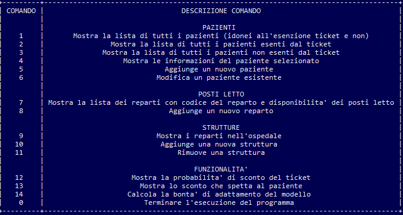
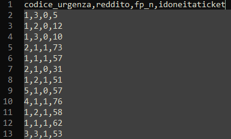
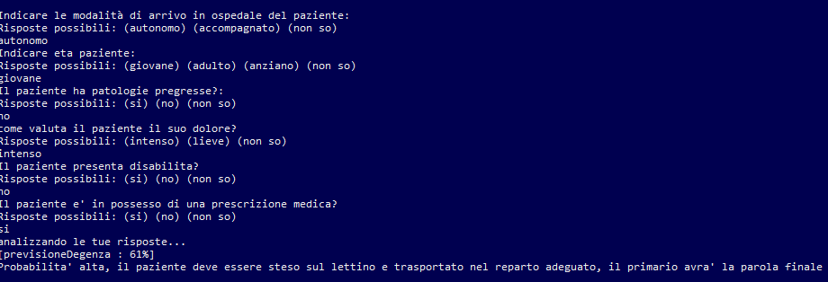

# Documentazione S.O.D. Gestionale Degenze

## **Sommario**

1. Introduzione
2. Requisiti funzionali
3. Interfaccia utente
4. Meccaniche principali
5. Sviluppo
6. Conclusioni

<br>

***
## **Introduzione**
<br>
Lo scopo di questo documento è quello di spiegare in maniera tecnica le funzionalità del programma **Sistema Ospedaliero Degenze (S.O.D.) Gestionale Degenza**.

Tale software è stato implementato da : 

- **Giuseppe Tortora** (Matricola: 656488)

- **Giacinto Carlucci** (Matricola: 649618)

Link al repository github:

https://github.com/GiacintoCarlucci/gestionale-degenze

Il software in questione è stato implementato al fine di organizzare le degenze all'interno di un Ospedale rispetto ai pazienti entranti e gestire le componenti:
1. Pazienti
2. Strutture
3. Percorsi

Inoltre si occupa di fare una stima sulla percentuale di sconto del ticket dopo la prestazione medica che spetta ad un paziente (attraverso l'uso di un classificatore) 
e di calcolare la probabilità di poter avere un posto letto all'interno di un reparto per un eventuale ricovero.

<br>

***
## **Requisiti funzionali**
<br>
Il programma per essere avviato necessita di alcuni pacchetti, installabili attraverso i seguenti comandi:

1. 'pybbn' -> ```pip install pybbn``` utile per la predizione;
2. 'pandas' -> ```pip install pandas``` utile per il classificatore e per il layout delle tabelle;
3. 'sklearn.tree' -> ```pip install scikit-learn``` utile per il classificatore; 
4. 'pyswip' -> ```pip install pyswip``` per la base di conoscenza in Prolog;
5.  bisognerà anche installare Swi-Prolog:
    - andare nel sito ufficiale;
    - recarsi nella sezione di download;
    - selezionare ```stable release```, scaricare la versione adatta al proprio sistema operativo;
    - successivamente installare il programma sulla propria macchina ```Add swipl to the system PATH for current user```.

<br>

***
## **Interfaccia utente**
<br>
Una volta avviato il programma verrà visualizzato un messaggio di benvenuto:

<br>
<center>

```Benvenuto nel portale S.O.D. Sistema Operativo Degenze```

</center>
<br>
E inoltre comparirà un messaggio di default a ogni interazione col S.O.D. per riaprire la lista dei comandi :

<br>
<center>

```Per visualizzare la lista dei comandi digita: -1 ```

</center>
<br>
La lista dei comandi che l'utente potrà utilizzare è la seguente:

<br>
<center></center>

<br>
Al termine dell'esecuzione comparirà tale messaggio e l'applicazione verrà chiusa:

<br>
<center>

```S.O.D. Programma Terminato```

</center>

<br>
All'interno del programma inoltre vengono effettuati dei controlli riguardo l'input dell'utente. Nel caso in cui dovesse inserire un comando o una parola errata apparirà un messaggio di errore.

<br>

***

## **Meccaniche principali**
<br>

Nel nostro applicativo software si è scelto di utilizzare:

1. Una **base di conoscenza**, all'interno del quale sono presenti le liste delle strutture, dei percorsi e dei pazienti, scritta in Prolog dai componenti del gruppo.

2. Un **classificatore** in grado di restituire l'ipotetico sconto del ticket per la prestazione medica del paziente in base al codice urgenza, reddito, se sia o meno in fascia protetta

<center></center>
<br>
Inoltre abbiamo utilizzato l'algoritmo Leave One Out con regressone lineare come classificatore poichè i dati a nostra disposizione erano pochi.

Abbiamo utilizzato un file CSV all'interno del quale ci saranno le informazioni su:
* **Codice Urgenza**;
* **Reddito**;
* **Fascia Protetta o meno**.

Ad ogni campo sono stati associati dei numeri interi:

<center></center>

Rispettivamente:
* Nel campo codice_urgenza è presente un numero che identificherà la gravità in cui si trova il paziete, i valori vanno da 1 a 6;
* Nel campo reddito è presente un numero che identificherà la fascia del reddito in cui si trova il paziente, i valori vanno da 1 a 3;
* Nel campo fp_n è presente un numero che identificherà l'utente se sia in fascia protetta (1) o no(0).
* Per quanto riguarda la percentuale di sconto del ticket abbiamo calcolato delle percentuali incrociando i possibili valori che i pazienti,
all'interno del database, potessero avere

3. Per predire la probabilità di degenza è stata usata una  **rete bayesiana**. Utile per avere una stima generale 
quando è presente un certo grado di incertezza. A tal fine l'utente dovra' rispondere ad alcune domande ponendole al paziente o valutandone le condizioni.

<center></center>

La rete bayesiana utilizzata
<center></center>

<br>

In base alla percentuale restituita:
* percentuale ```< 30%``` fascia ```Degenza non prevista```;
* percentuale ```< 45%``` fascia ```bassa```;
* percentuale ```< 60%``` fascia ```media```;
* percentuale ```< 80%``` fascia ```alta```;
* percentuale ```>= 80%``` fascia ```Ricovero Immediato```.

<br>

Ogni risposta è pesata differentemente e queste percentuali sono determinate da:

* **Modalità di Arrivo**: se il paziente è stato accompagnato o si è recato in ospedale autonomamente;  
* **Età Paziente**: l'età è stata suddivisa in tre fasce giovane - adulto - anziano;
* **Info Paziente**: contiene Età Paziente e Modalità di Arrivo;
* **Disabilità**: se ha o meno disabilità di qualsiasi tipo che siano (fisiche, psichiche);
* **Dolore**: chiedere di valutare l'entità del dolore al paziente;
* **Cartella Clinica**: contiente Disabilità e Dolore;
* **Urgenza**: valutata in base alle risposte date in Info Paziente e Cartella Clinica;
* **Patologie Pregresse**: se il paziente ha o meno patologie pregresse;
* **Prescrizione Medica**: se il recarsi in ospedale è dovuto ad una visita medica prescritta anticipatamente;
* **Visita Medica**: contiene Patologie Pregresse e Prescrizione Medica;
* **Previsione Degenza**: Contiene Urgenza e Visita Medica e definisce una previsione in percentuale per la degenza del paziente,
ovvero se il paziente deve essere ricoverato o meno;

<br>

***

## **Sviluppo**

<br>

Il gruppo ha sviluppato tale progetto a Settembre 2022 in remoto utilizzando la piattaforma gitHub, come linguaggio Python per il codice e implementazione algoritmi,
Prolog per costruire la base di Conoscenza ed Excel per i database.

<br>

***

## **Conclusioni**

<br>

Tale progetto è stato molto interessante in quanto i membri del gruppo, in previsione di una specializzazione futura in Intelligenza Artificiale, hanno avuto la possibilità in gettare le prime basi in questo ambito.

<br>

<center>

Il gruppo, **[S.O.D. Gestionale Degenze]**

</center>
